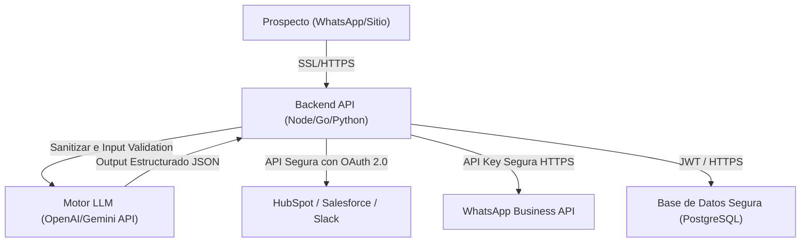

# Notas de Seguridad y Privacidad (Security & Privacy Audit)

Este documento detalla los estándares de seguridad implementados en la demo pública de **Aloria B2B Lead Intelligence**, sus consideraciones contra vulnerabilidades frontend comunes y la hoja de ruta técnica para integraciones reales seguras en fases de producción.

---

## 🔒 Estado de Seguridad de la Demo Actual

### 1. Ausencia de Backend y Persistencia Real
*   La aplicación se ejecuta **100% en el lado del cliente (Client-Side SPA)**. 
*   No hay almacenamiento persistente de datos de usuario en cookies, `localStorage`, `sessionStorage`, ni bases de datos remotas.
*   Todos los leads generados y las simulaciones de chat se purgan por completo al refrescar la pestaña del navegador.

### 2. Zero Secrets / Sin API Keys expuestas
*   No se exponen tokens, API keys, credenciales de correo, tokens de WhatsApp Business API, ni claves de integración con CRMs (HubSpot, Salesforce, Slack).
*   Las secciones que demuestran la inyección a CRMs son simulaciones visuales con fines ilustrativos.

### 3. Privacidad y Datos Personales
*   La demo está diseñada para utilizarse con **datos ficticios y simulados**.
*   No se solicita, recolecta ni transmite información personal real (nombres completos, teléfonos personales, correos reales o secretos comerciales corporativos). 
*   Cualquier entrada que el usuario decida ingresar en los campos manuales de chat permanece aislada en la sesión del navegador.

---

## 🛡️ Mitigación de Vulnerabilidades Frontend (XSS-lite)

Se realizó una auditoría de seguridad para mitigar ataques de **Cross-Site Scripting (XSS)** debido a la manipulación dinámica del DOM con `innerHTML`.

### Medidas Implementadas:
1.  **Función de Sanitización Centralizada (`escapeHTML`):**
    Se implementó un helper nativo de alta eficiencia para escapar de forma segura caracteres de control HTML e impedir que scripts inyectados en campos de texto libre sean ejecutados por el motor de render:
    ```javascript
    function escapeHTML(str) {
      if (str === null || str === undefined) return "";
      return String(str)
        .replace(/&/g, "&amp;")
        .replace(/</g, "&lt;")
        .replace(/>/g, "&gt;")
        .replace(/"/g, "&quot;")
        .replace(/'/g, "&#039;");
    }
    ```
2.  **Sanitización Completa de Entradas de Usuario:**
    Cualquier campo dinámico derivado directa o indirectamente de `chatAnswers` (las respuestas ingresadas por el usuario en el chatbox) es sanitizado a través de `escapeHTML()` antes de ser asignado o interpolado en estructuras HTML:
    *   *WhatsApp preview:* Escapa decisor, dolores detectados, empresa y alcance.
    *   *Dashboard Rows:* Escapa el nombre de la empresa y la entrada de texto del lead captado.
3.  **Preferencia por TextContent:**
    Para todas las inserciones del *AI Sales Brief* y la tarjeta de scoring que no requieren formato de markup (negritas, cursivas o saltos de línea estructurados), se utiliza de forma estricta la propiedad `.textContent` del navegador en lugar de `.innerHTML`.
4.  **Generación de Estructuras Seguras de WhatsApp:**
    La visualización de WhatsApp emplea un parser controlado que reemplaza exclusivamente los saltos de línea (`\n` a `<br>`) y marcas de negrita controladas (`*texto*` a `<strong>texto</strong>`) únicamente **después** de haber sanitizado todo el contenido de texto plano.

---

## 🚀 Hoja de Ruta para Integración Real en Producción

Para migrar esta demostración a un producto real conectado, se deben adoptar las siguientes arquitecturas de seguridad robusta:



### 1. Autenticación y API Gateway
*   **Gemini / OpenAI API Keys:** Nunca deben ser invocadas en el cliente frontend. Deben almacenarse en variables de entorno seguras (`.env`) en un servidor backend o funciones serverless (Vercel Functions, Firebase Cloud Functions).
*   **Validación de Tokens:** Las peticiones desde el frontend al backend se autenticarán mediante tokens web JSON (JWT) transmitidos en cabeceras de autorización HTTP seguras.

### 2. Sanitización en Backend
*   Incluso con protecciones en el cliente, todas las entradas recibidas por los Webhooks de WhatsApp o de formularios web deben sanitizarse en el servidor utilizando bibliotecas como `DOMPurify` o filtros robustos contra inyecciones SQL y scripts malignos.

### 3. Almacenamiento Seguro (GDPR / LFPDPPP)
*   **Encriptación en Reposo y Tránsito:** Todos los datos de leads captados que contengan información personal deben almacenarse en bases de datos con encriptación AES-256 (en reposo) y transportarse mediante protocolos seguros HTTPS/TLS 1.3.
*   **Políticas de Retención:** Establecer mecanismos para la eliminación automatizada o anonimización de datos de leads no calificados después de un periodo de inactividad de 30 días para cumplir con las normativas internacionales de protección de datos.
